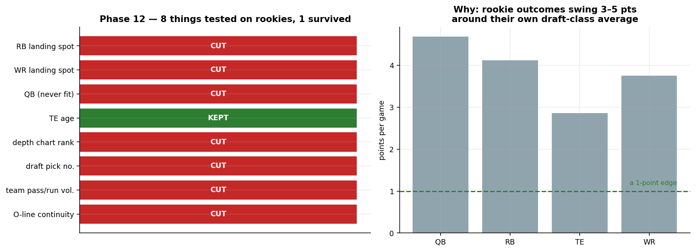
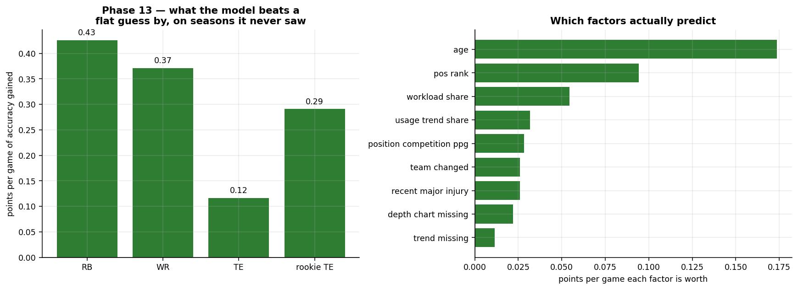
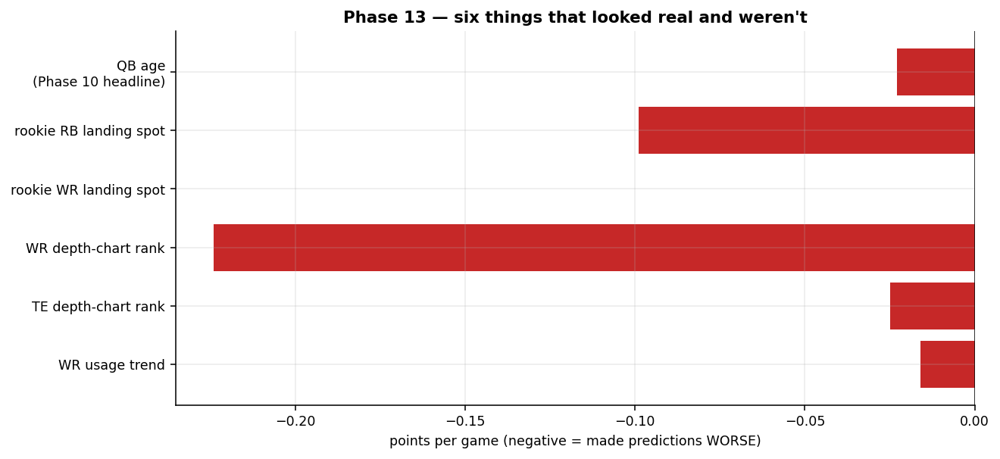

# Phases 12 & 13, in plain English

What we tried, what survived, and what to actually trust on draft day.

---

## The one-paragraph version

We tried to teach the model that a rookie's **landing spot** matters, and it mostly
couldn't learn it. Then we did something the project had never done in 13 phases: we
tested the whole model on seasons it had never seen. **Four things that everyone had
believed turned out not to predict anything**, including the previous phase's headline
finding. We cut them. What's left is smaller, less exciting, and is the first version of
this model that has actually been tested.

---

## Phase 12 — can we tell where a rookie landed?

**The problem.** Two rookie running backs drafted in the same round got the *exact same*
projection — 15.12 points — whether one landed in Arizona and the other in Seattle. The
model had no way to see the difference. Every veteran got team context; rookies got
none.

**What we tried.** Eight things you'd expect to matter for a rookie: how much his new
team throws and runs, how good the players ahead of him are, whether the offensive line
returned, where he sits on the depth chart, how high he was drafted within his round, and
his age.

**What survived: one.** Tight end age. That's it.

**Why it failed, and it's not really the model's fault.** The right-hand chart is the
whole story. Rookie outcomes swing **3 to 5 points per game** around their own draft-class
average. A useful fantasy edge is about *one* point. You're trying to hear a whisper in a
stadium. Five draft classes of data isn't remotely enough to pick out a signal that
small.

**What we can say for certain:** the popular story that a rookie "fell into a perfect
situation" has **no measurable predictive value** in this data. Not for backs, not for
receivers. If someone tells you a rookie is a lock because of his landing spot, that
belief has now been tested and it did not survive.

---

## Phase 13 — testing the whole model honestly for the first time

**The thing nobody had done.** Every accuracy number this project ever produced was
measured on the *same data used to build the model*. That's like grading your own
homework with the answer key open. It always looks good.

So: we hid three seasons (2023, 2024, 2025), rebuilt the model without them, and asked it
to predict those seasons cold.

**We compared three things:**

| | what it does |
|---|---|
| **RAW** | assume every player repeats his own recent average |
| **LEVEL** | RAW, plus a single constant nudge for everyone |
| **MODEL** | the real thing, with all its factors |

**The middle one is the point, and it wasn't in the original plan.** A model made
entirely of nonsense can still beat RAW, because that one constant nudge does the work.
The only honest question is whether the *factors* beat a constant. We nearly shipped a
test that couldn't tell the difference.

**Good news: they do.** Left chart — the model beats a flat guess by 0.43 points/game at
RB, 0.37 at WR, 0.12 at TE. Real, and modest. Right chart — **age does most of the
work**, by a factor of two over anything else.

**Bad news: six things we believed turned out to be fiction.**

The most painful one is **QB age**. The previous phase's headline was "quarterbacks
finally have a weight for the first time in project history." It had a beautiful p-value.
It held up under every check we had. Then it made 2024 and 2023 predictions actively
*worse*, and we deleted it. Quarterbacks now get no adjustment at all.

**One thing worked, and it's the one you asked for.** You noticed Bhayshul Tuten ranked
150th with an ADP of 51, because the model could only see his thin 2025 production, not
that he's the starter now. So we tested depth-chart position.

It works — **at running back only**, worth about 2 points/game between being RB1 and RB3.
Tuten moved from 148th to 109th. It failed badly at receiver and tight end, which makes
football sense: an RB depth chart is close to a statement about who gets the ball, while
a "WR3" label tells you very little about targets.

---

## Your three questions

### Is the rookie haircut answered? **No.**

I tried twice and **both tests were rigged without my noticing.** Both compared rookies
against a baseline that was *built from rookies* — so the answer was determined by the
setup, not by the data. The clean-looking result was arithmetic, not evidence.

The real question is different: both rookie and veteran baselines are built only from
players who lasted 8+ games. So both mean *"what you'd score **if** you earn a role."*
The board then applies that to everyone — which flatters rookies badly, because far more
of them never earn a role. **415 of 600** drafted rookies even reached 8 games, and ones
who never took a snap aren't in that 600 at all.

So the question is "what are the odds this guy plays," and the board doesn't ask it.

### Are the RBs inflated? **Possibly, and here's the honest split.**

Running backs went from 25 to 31 of the top 60 after we added depth-chart position. The
mechanism is sound: backups now get pushed down hard, so the "freely available" back you
compare everyone against is worse, so every real starter looks better by comparison.

**But two different claims are hiding in there, and only one has been tested.** We proved
depth-chart position *predicts points better*. We did **not** test whether the resulting
RB share of the top 60 is right — that depends on replacement level, which the holdout
never touches. Your instinct deserves weight here. Trust the model's *ordering* of backs;
be skeptical of *how many* of them it wants you to take.

### Should we build the playing-time model before the draft?

**Yes, but with a hard stop.** It's the biggest remaining gap and 16 days is enough. Two
protections make it safe to attempt:

1. The gate means it **cannot ship unless it beats a constant** on three unseen seasons.
2. v13 is finished, validated, and sitting on disk — a fallback that already works.

**The rule I'd set: if it isn't passing by Aug 17, freeze and draft off v13.** That keeps
the plan's original slack for ADP refreshes and preseason injuries. The risk isn't that
the new model is wrong — the gate catches that. It's spending the last five days
debugging instead of preparing.

---

## The stats words we used, in English

**Baseline** — what a player did recently, weighted toward last season. The starting
point before any adjustment.

**Delta** — not points, but the *change* from a player's own baseline. Everything in this
model predicts delta, which is why some coefficients read backwards (see mean reversion).

**Coefficient** — how much one factor moves the projection. "Age −0.44 at RB" means each
extra year costs about 0.44 points/game.

**Intercept** — the constant every player at a position gets. Sounds boring; a missing
one caused this project's worst bug, where every single adjustment came out negative for
two whole phases.

**p-value** — "if this factor truly did nothing, how surprising would this pattern be?"
Below 0.10 counts as a finding here. **The big lesson of Phase 13: a good p-value does
not mean a factor predicts the future.** QB age had one and still failed.

**R²** — the share of variation explained. Ours is 12–18%, meaning **most of fantasy
football is genuinely unpredictable.** Anyone claiming much higher is grading their own
homework.

**RMSE** — average size of a miss, in points/game. Lower is better. This is what the
holdout scores on.

**Holdout / out-of-sample** — hiding data, building without it, then predicting it. The
only test that can't be fooled by a model memorizing its own training data.

**Ablation** — remove one factor, rebuild, see if predictions get worse. If they get
*better*, that factor was hurting. This is how we caught the six cuts.

**Mean reversion** — why "high workload share" carries a *negative* number. A back
already getting 65% of carries has nowhere to grow; one at 25% has room. The model
predicts *change*, so already-maxed-out players get marked down.

**Shrinkage** — pulling projections built on thin evidence toward a conservative
average. A player with 8 career games gets dragged toward the middle; one with 40 doesn't.

**Standard error** — the wobble on an estimate. A gap of 0.057 with a standard error of
0.199 is **noise**, and I nearly reported one as a finding before checking.

**Collinearity** — two factors measuring overlapping things. Only a problem if it makes
the numbers unstable; at RB, "does he have the job" and "how much has he already
converted" overlap and are still both real.

**Leave-one-out** — rebuild nine times, each time hiding one season, and check the answer
doesn't lurch. Catches a "finding" that's really just one weird year.

---

## What to actually do on draft day

**Trust:** age (the most tested thing in the model), the RB depth-chart signal, and the
32-team replacement levels — those come from your real mock, not a guess.

**Don't trust:** rookie rankings. They're the board's biggest disagreements with the
market *and* its least-evidenced output, and now you know exactly why.

**Use judgment on:** how many running backs to take on the 12-team board, and anything
you know that the model can't — a holdout, a camp report, a trade it hasn't seen. That's
what `injury_overrides.csv` is for.
